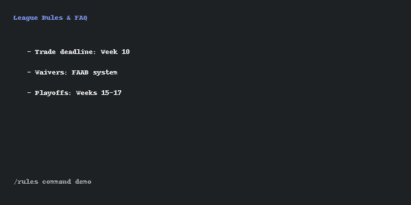
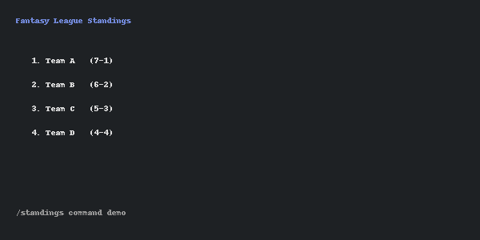
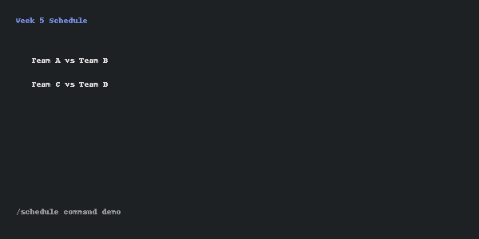
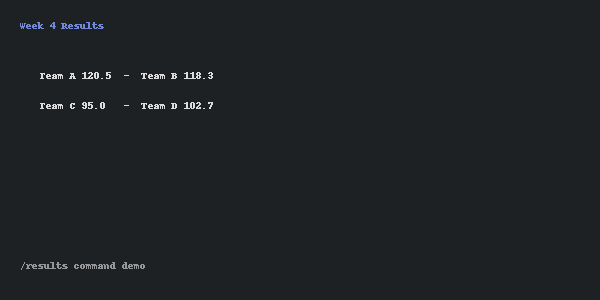
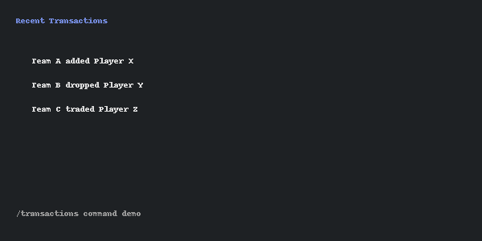
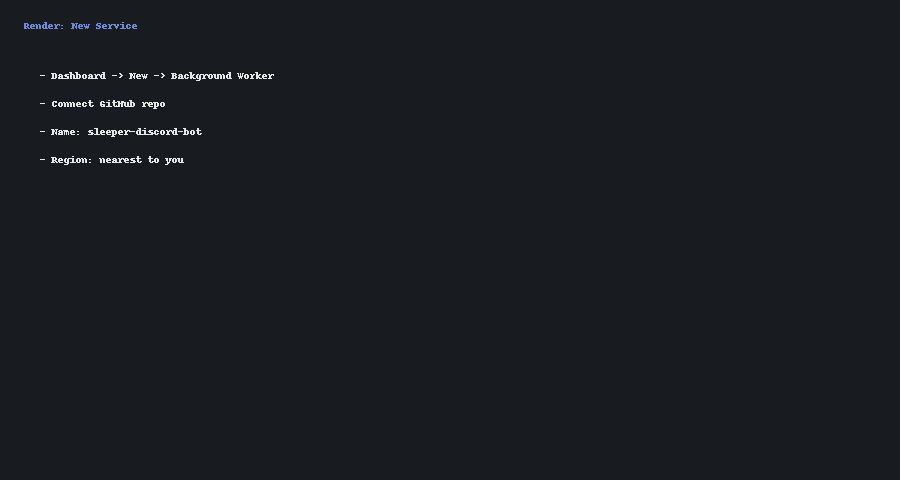
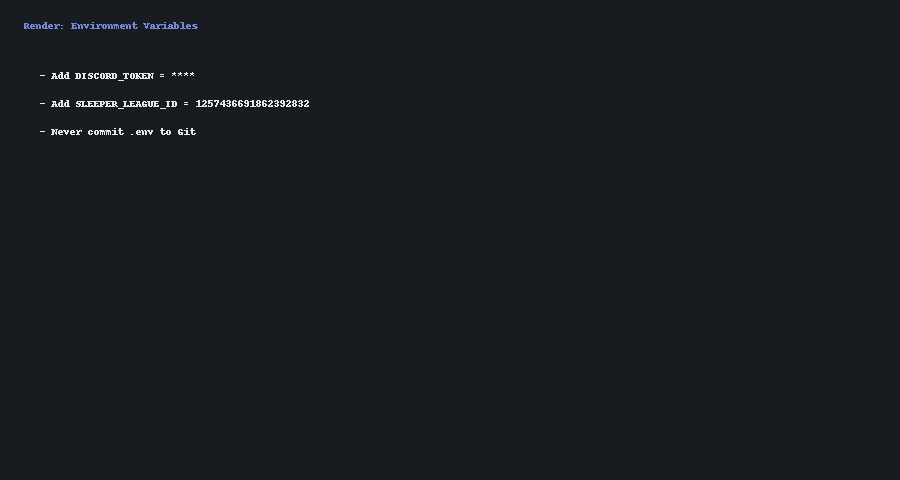
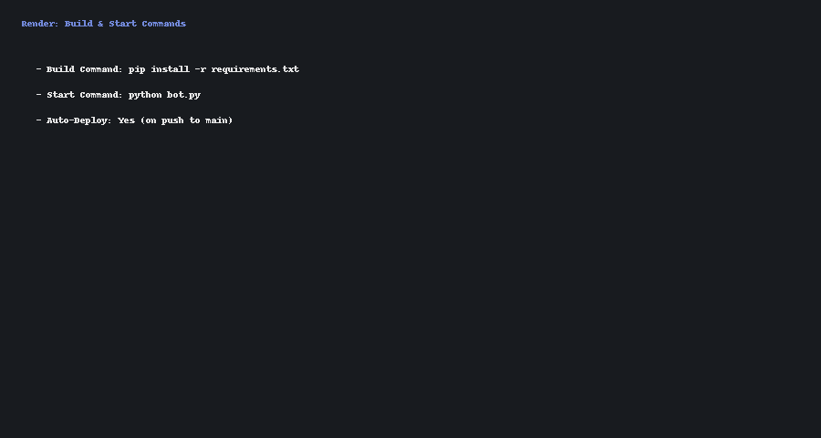
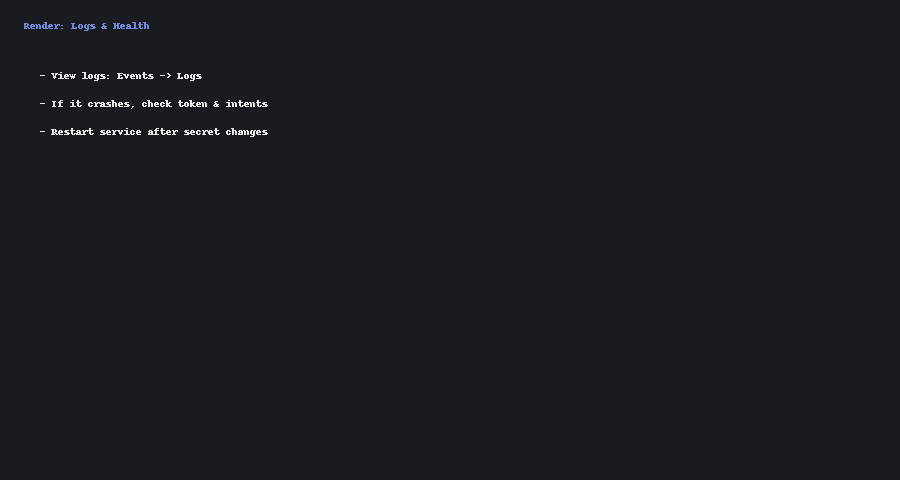

# Sleeper x Discord Bot

A Discord bot that connects your Sleeper fantasy football league to your Discord server.  
Get quick access to league rules, standings, schedule, results, and transactions right from Discord.

---

## 🚀 Features
- `/rules` – View common league rules and FAQs  
- `/standings` – Show the current league standings  
- `/schedule` – Display weekly matchups  
- `/results` – Show completed matchup results  
- `/transactions` – Show latest league activity  

---

## 🛠️ Installation

1. Clone the repo:
   ```bash
   git clone https://github.com/YOUR-USERNAME/sleeper-discord-bot.git
   cd sleeper-discord-bot
   ```

2. Create and activate a virtual environment:
   ```bash
   python -m venv .venv
   source .venv/bin/activate   # Mac/Linux
   .venv\Scripts\activate      # Windows
   ```

3. Install dependencies:
   ```bash
   pip install -r requirements.txt
   ```

4. Run locally:
   ```bash
   python bot.py
   ```

---

## ⚙️ Configuration

Create a `.env` file in the project root with your credentials:

```env
DISCORD_TOKEN=your_discord_bot_token
SLEEPER_LEAGUE_ID=1257436691862392832
```

> ⚠️ Keep your token private. Never commit `.env` to GitHub.

---

## 💻 Commands

| Command         | Description                          |
|-----------------|--------------------------------------|
| `/rules`        | Shows league rules & FAQ             |
| `/standings`    | Displays current league standings    |
| `/schedule`     | Lists matchups for the week          |
| `/results`      | Shows completed game results         |
| `/transactions` | Displays recent trades/waivers       |

---

## 📸 Screenshots

### Example: `/rules`


### Example: `/standings`


### Example: `/schedule`


### Example: `/results`


### Example: `/transactions`


---

## 📦 Deployment

This bot is live on [Render](https://render.com).  
Push to `main` and Render will auto-deploy.

---


---

## ☁️ Render Deployment (Step‑by‑Step)

> Works as a **Background Worker** (recommended) or **Web Service** if you’re also hosting an HTTP endpoint.

### 1) Connect Repo & Create Service
1. Go to Render Dashboard → **New** → **Background Worker**
2. Connect your GitHub repo `sleeper-discord-bot`
3. Choose a region near you and click **Create**
   


### 2) Set Environment Variables
Add the following in **Environment → Add Environment Variable**:
- `DISCORD_TOKEN` — your Discord bot token
- `SLEEPER_LEAGUE_ID` — e.g. `1257436691862392832`



### 3) Build & Start
- **Build Command:** `pip install -r requirements.txt`
- **Start Command:** `python bot.py`
- Turn on **Auto Deploy** for the `main` branch



### 4) Verify Logs & Troubleshoot
- Open **Events → Logs** to see startup messages
- If the service exits:
  - Re‑check your `DISCORD_TOKEN`
  - Confirm your bot **Privileged Gateway Intents** in the Discord Developer Portal (Members/Presences if needed)
  - Restart after updating secrets



**Notes**
- Use a **Background Worker** if the bot doesn’t need to serve HTTP traffic.
- If you also want a health check or a small web dashboard, use a **Web Service** and keep a tiny HTTP server running alongside the bot.


## 📝 License
MIT License
